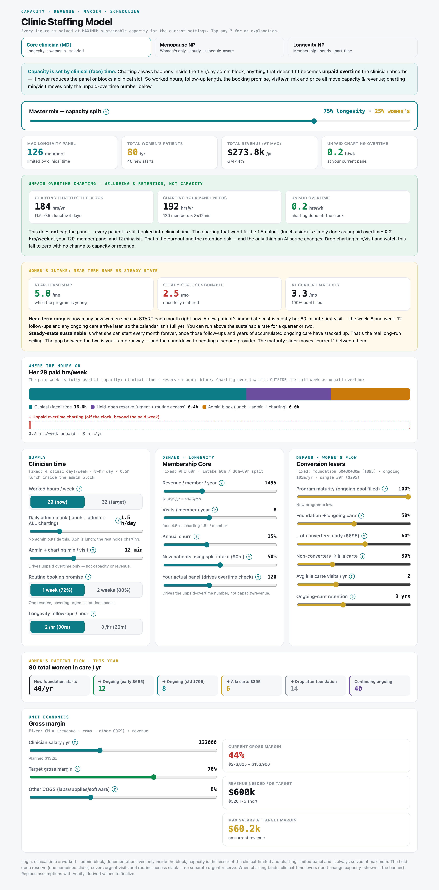
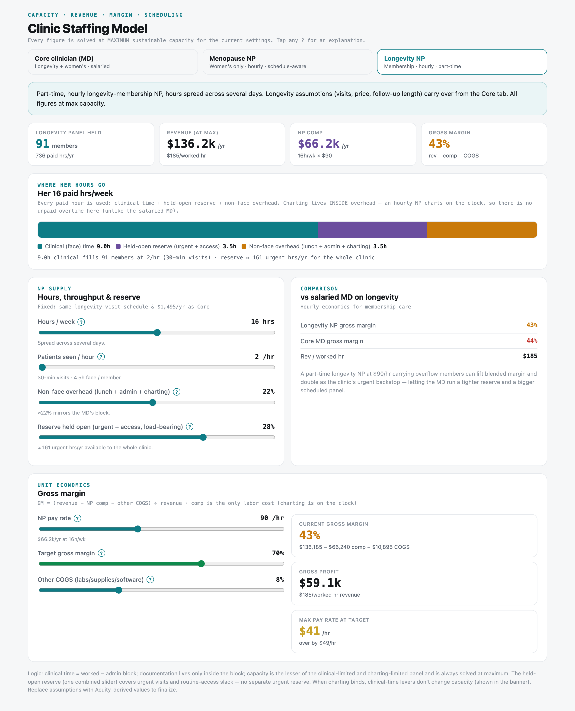
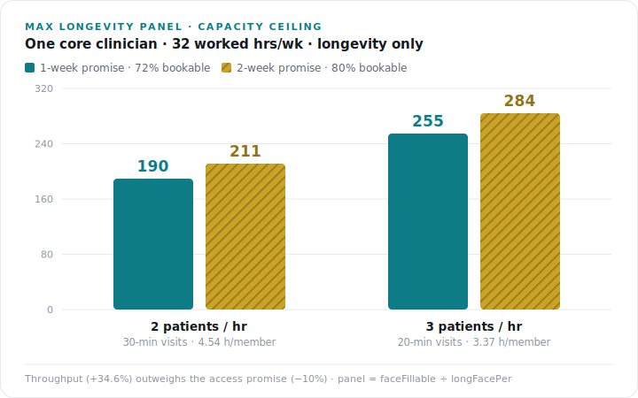
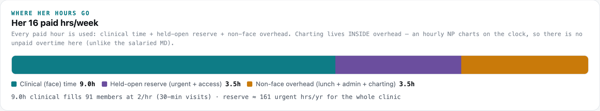

# Optimal Clinic — Staffing & Capacity Model
### Product Requirements Document

| | |
|---|---|
| **Owner** | Peter Phua · Optimal Research Team |
| **Status** | Live · v0.9 (model) · **no access control — see §10** |
| **Last updated** | 2026-07-16 |
| **Live** | https://optimal-research-team.github.io/optimal-clinic-model-site/ (⚠️ publicly accessible) |
| **Source** | `Optimal-Research-Team/optimal-clinic-model` (private) |
| **Host** | `Optimal-Research-Team/optimal-clinic-model-site` (public, built assets only) |
| **Related** | [`CONTEXT.md`](CONTEXT.md) · [`ASSUMPTIONS.md`](ASSUMPTIONS.md) · [`CLAUDE.md`](CLAUDE.md) |

---

## 1. TL;DR

An interactive model that answers one question the clinic cannot currently answer with confidence: **how many patients can we actually carry, and what does it cost us to carry them?**

It solves capacity, revenue, gross margin, and scheduling at *maximum sustainable load* across three provider scenarios (salaried MD, hourly menopause NP, hourly longevity NP). Every figure is derived from a small set of explicit levers, and every lever is annotated with what it does and whether it is measured or assumed.

Its second job is strategic: it is the quantitative case for **Blair** (the agentic clinic-OS), and it is deliberately built so that Blair's value shows up *honestly* — as clinician wellbeing and retention, not as an inflated throughput claim.

---

## 2. Problem

The clinic runs two product lines off effectively one clinician:

- **Longevity Membership Core** — $1,495/yr, ~8 visits/member/yr, ~120 members today.
- **Women's Hormone program** — $895 foundation (3 months), optional ongoing care ($695/$795), à-la-carte at $295.

Three pressures collide:

1. **Inbound women's-hormone demand is ~20+/month** — far above what one clinician can absorb at steady state. Someone has to decide what to turn away, or who to hire.
2. **Nobody knows the real ceiling.** Panel size, mix, access promises, and visit lengths interact non-linearly. Gut feel cannot price a second provider.
3. **Documentation load is invisible.** It never shows up on the schedule, so it never enters staffing decisions — it just quietly lands on the clinician after hours.

Without a model, every staffing conversation is an argument between anecdotes.

---

## 3. Goals / Non-goals

**Goals**
- Solve max sustainable capacity for any combination of levers, per provider type.
- Make the *cost* of each strategic choice explicit (access promise, mix, visit length, price, pay).
- Expose unit economics honestly — including when the target margin is **not** reachable.
- Surface documentation load as a real, quantified burden without letting it distort capacity.
- Be self-explanatory: every slider carries a `?` explaining what it does and why it matters.
- Clearly separate **measured** from **assumed**, so conclusions can be audited.

**Non-goals**
- Not a scheduler, EMR, or billing system. It models; it does not operate.
- Not a per-patient forecast. It works in steady-state averages.
- Not a financial model of the whole business (no rent, marketing, capex — gross margin only).
- Not multi-user. No accounts, no persistence, no audit trail.

---

## 4. Users

| User | Question they bring |
|---|---|
| **Peter (owner/operator)** | Do I hire? Which role? What can I pay them and still clear margin? |
| **Core clinician (MD/NP)** | How much unpaid documentation am I absorbing, and what would fix it? |
| **Blair (product strategy)** | What is charting automation actually worth to a clinic like this? |

---

## 5. Product surface

Three tabs, one shared set of assumptions. Every figure is solved at maximum sustainable capacity for the current settings.

**1. Core clinician (MD)** — salaried, carries both lines. A master mix slider splits her bookable time between longevity and women's; panel sizes, revenue, margin, and unpaid-overtime charting all solve from it.



**2. Menopause NP** — hourly, women's-only, part-time. Adds a scheduling-continuity model: the foundation program has fixed-offset follow-ups (wk 6, wk 12) plus unpredictable PRN, so a thin roster structurally loses capacity. Two 3-hr days beat one 6-hr day by ~20%.

**3. Longevity NP** — hourly, membership-only, part-time. Its held-open reserve is load-bearing as the clinic-wide urgent backstop.



---

## 6. How the model works

The entire capacity engine reduces to three lines:

```
faceWeek     = workedHrs − adminBlock × DAYS          ← clinical (face) hrs / week
faceFillable = faceWeek × WK × util                   ← BOOKABLE clinical hrs / year
maxPanel     = faceFillable ÷ longFacePer             ← members
```

with `DAYS = 4`, `WK = 46`, and the per-member clinical load:

```
longFacePer = [ 60 + (visits−1)·(60/patientsPerHour) + churn·split·30 ] ÷ 60
                ▲AHE      ▲follow-ups                  ▲re-onboarding churn
```

`util` is the **booking promise**: 0.72 for a 1-week promise, 0.80 for 2-week. It bundles urgent reserve *and* routine-access slack into one number.

Documentation lives in a separate track and — critically — **never enters the equation above**.

---

## 7. Key lessons

These are the hard-won conclusions. Several were learned by getting them **wrong first**.

### 7.1 Capacity is face time. Charting never caps the panel.

This was corrected twice. An earlier version modeled charting as a competing constraint (a "dual constraint": clinical time vs charting time), which produced a satisfying but **false** result — that documentation shrinks the panel.

The clinic's reality: the day has a fixed 1.5h admin block. Patients are booked into clinical time. Charting happens inside the block, and **whatever doesn't fit is absorbed as unpaid overtime**. It does not block a clinical slot. It does not reduce the panel.

> **Consequence:** `docMin` (admin+charting min/visit) drives *exactly one number* — unpaid overtime. It has zero effect on capacity or revenue.

This is the most important structural decision in the model, and the easiest to accidentally regress.

### 7.2 Therefore Blair's value is wellbeing, not throughput.

This falls directly out of 7.1 and is the honest framing the model was built to force. Automating charting drives `docMin` down, which drives unpaid overtime toward zero — **with no change to capacity or revenue**.

That is a weaker-sounding claim than "an AI scribe lets you see more patients," and it is the *true* one. A clinician who isn't doing hours of unpaid documentation stays. The ROI is retention, not volume. A model that claimed throughput gains here would be lying, and the first clinic to actually measure it would catch us.

### 7.3 The access promise is a linear 10% tax.

The booking promise enters as a single multiplier:

```
1-week promise → util = 0.72   (hold ~28% of clinical time open)
2-week promise → util = 0.80   (hold ~20% open)
```

To *guarantee* a routine visit within a week, you mathematically cannot book the calendar to 100% — you must hold slack so an arriving request finds a near-term opening. The ratio is fixed: `0.72 / 0.80 = 0.90`.

> **A 1-week promise costs exactly 10% of the panel — regardless of every other setting.**

At 32 hrs/wk and 2 patients/hr, that's 190 members instead of 211. The reserved 28% is `1,196 × 0.28 = 335` face hrs/yr, deliberately left unbookable.

### 7.4 Throughput outweighs access by roughly 3.5×.



Moving from 2 to 3 patients/hour shortens follow-ups from 30 to 20 min. The 60-min annual exam is untouched; only the 7 follow-ups shrink, saving `7 × 10 = 70 min/member/yr`. Per-member clinical load drops from **4.54 → 3.37 hrs**, a 25.7% cut, which scales capacity by **+34.6%**.

Set against the access promise's −10%, the ranking is unambiguous: **visit length is the dominant capacity lever.** You could pay for the entire 1-week access promise out of the throughput gain and still be far ahead.

> **Caveat that matters:** 3/hr is the optimistic end. Whether 20-min longevity follow-ups hold up clinically — and in *actual booked durations* — is unverified. This single assumption swings the ceiling by 65 members.

### 7.5 Salaried and hourly clinicians need opposite math.

The same word — "documentation" — behaves in two completely different ways:

| | Salaried MD | Hourly NP |
|---|---|---|
| Where charting happens | Inside a fixed admin block | Inside paid hours |
| Overflow | Unpaid overtime (absorbed) | N/A — it's on the clock |
| Effect on capacity | **None** | **Consumes billable time** |
| Effect on P&L | Retention risk | Direct cost |

This asymmetry is intentional and load-bearing. Collapsing it into one rule would break one of the two provider models.



### 7.6 The part-time NP does not clear the margin target — and the model says so.

The prior strategic note read: *"a part-time longevity NP at $90/hr carrying overflow members can lift blended margin."* Once the gross-margin math was actually built, that claim became testable — and it does not hold at the assumed settings:

```
16 hrs/wk × 46 = 736 paid hrs/yr → 91-member panel → $136.2k revenue
comp $66.2k + COGS $10.9k → gross profit $59.1k → GM 43%
Max pay rate at a 70% target = $41/hr  (current $90/hr is over by $49)
```

**A 91-member panel cannot carry a $90/hr NP at a 70% margin.** The options are real and now visible: grow the panel, cut the rate, or accept ~43% and justify the NP on a *different* basis — as the clinic-wide urgent backstop that lets the MD run a tighter reserve and a bigger scheduled panel.

The lesson is about model-building, not just NPs: **a strategy note you cannot compute is a hypothesis, not a finding.** Building the calculation is what converts it.

### 7.7 One reserve, not two.

Early versions had a separate "urgent reserve" slider *and* an access buffer. They are the same idea — don't run at 100% — and modeling both double-counted the reserve. Merging them into the booking promise removed a whole class of user confusion and a quiet arithmetic error.

### 7.8 A model's defaults are its argument.

`docMin`, `util`, visits/member/yr, churn, the women's conversion rates, and the NP fragmentation constant `k` are all **estimates**. They carry the conclusions. The model is only as credible as its willingness to label them — which is why every placeholder is marked, and why §11 exists.

### 7.9 Static hosting forces an explicit security trade-off — and a gate nobody can log into is worth nothing.

GitHub Free will not serve Pages from a private repo. So "password-protected static site" is not one decision but two: where the *readable source* lives, and where the *compiled bundle* lives. Resolved by splitting them (see §10). Worth stating plainly: **a client-side gate hides the UI, not the bundle.**

The sharper lesson came from shipping one. A controlled React input only updates its state from a real `onChange`; password managers and autofill often set `input.value` directly, so the field *looks* filled while the component still holds `""` — and submit silently does nothing. The gate was verified working (hash confirmed correct in-browser) and still failed for a real person on a real login.

Two takeaways. **Verifying the happy path is not verifying the feature** — the automation workaround I used to get past the gate was itself the bug report, and I treated it as a test-harness quirk instead of a finding. And **security that degrades usability gets deleted**, taking its protection with it. A gate that is merely inconvenient converges to no gate at all, which is strictly worse than choosing edge auth up front.

---

## 8. Worked example: what actually caps the practice

One core clinician, longevity only, model defaults, at the target 32 hrs/wk:

| | 2 patients/hr | 3 patients/hr |
|---|---|---|
| **1-week promise (72%)** | 190 members | **255 members** |
| **2-week promise (80%)** | 211 members | 284 members |

At today's 29 hrs/wk: 168 / 226 (1-week) and 187 / 251 (2-week).

Reading the grid: the vertical step (access promise) is worth ~21–29 members. The horizontal step (throughput) is worth ~65. **Hours and visit length set the ceiling; the access promise trims it.**

---

## 9. Model invariants — do not regress

1. **Capacity = clinical (face) time only** for the salaried MD.
2. **Charting never caps the panel.** Overflow is unpaid overtime.
3. **`docMin` affects only the unpaid-overtime figure** — never capacity or revenue.
4. **One reserve, not two.** The booking promise bundles urgent + access slack.
5. **Lunch is a fixed 0.5 h/day** inside the admin block.
6. **Salaried vs hourly asymmetry is intentional** (see 7.5).
7. **Every figure is solved at maximum sustainable capacity.**
8. **Total women's/yr = new foundation starts + continuing ongoing.** À-la-carte and drops are subsets of new starts.
9. **Every slider keeps its `?` explanation.**

---

## 10. Access & deployment

**Constraint:** GitHub Free cannot publish Pages from a private repo, but the model's source (salary, prices, panel math, and the CONTEXT/ASSUMPTIONS prose) is sensitive.

**Resolution — split the two concerns:**

| | Repo | Visibility | Contains |
|---|---|---|---|
| Source | `optimal-clinic-model` | **Private** | Full source, math, business context, this PRD |
| Host | `optimal-clinic-model-site` | Public | Compiled `dist` bundle only |

### ⚠️ Current state: no access control

A client-side SHA-256 password gate was built and then **removed** (2026-07-16) — it was rejected in use, most likely because password managers and browser autofill set the input value without firing React's `onChange`, leaving the component's state empty so submit silently bailed. The same failure mode showed up under automation.

**What this means today:** anyone with the URL can read the full model — panel sizes, pricing, salary, and margins. `noindex, nofollow` discourages search engines but is only a request, and it does nothing about a forwarded link. The private source repo still keeps the readable source and the business-context prose off the public internet; the *compiled* model is public.

That is fine for a link shared deliberately with a few people. It is not fine if the financials should be genuinely restricted.

### Options, in order of strength

| Option | Protects the bundle? | Effort |
|---|---|---|
| **Cloudflare Access** in front of the site — named identity (email OTP or Google/MS SSO) + audit log | Yes — auth happens at the edge, before any asset is served | Medium · no app code |
| **Vercel Basic Auth** via edge middleware, password in an env var | Yes — same, one shared password, no per-user identity | Low |
| **Fix and restore the client gate** (bind autofill correctly via the native value setter + an `input` listener) | No — hides the UI only | Low |
| **Unpublish** the Pages site; run locally with `npm run dev` | N/A — nothing is served | Trivial |

The gate implementation is recoverable from git history (`src/Gate.jsx`, `src/gate.config.js`) if it's wanted back. See [`CLAUDE.md`](CLAUDE.md) for the full deployment write-ups.

---

## 11. Open calibration questions

Replace guesses with measured values from an anonymized Acuity/EMR export. Ranked by leverage:

| # | Input | Why it matters |
|---|---|---|
| 1 | **Real charting min/visit** by type | The entire unpaid-overtime figure — and Blair's whole value case — scales off this. |
| 2 | **Visit-length distribution** | Decides whether 3/hr is real. Worth ±65 members. |
| 3 | **Schedulable utilization (`util`)** | Derive from booking-to-appointment lead times, not the 0.72/0.80 assumption. |
| 4 | **No-show / cancellation rate** | Inflates "scheduled" above "delivered" — currently unmodeled. |
| 5 | **Real visits/member/yr** | Assumed 8; drives per-member load linearly. |
| 6 | **Women's conversion / early / à-la-carte / retention** | Assumed 50/60/30/3yr; drives the whole women's revenue funnel. |
| 7 | **Fragmentation constant `k`** | Back out from the menopause NP's real fill vs sessions worked. |

---

## 12. Roadmap

**Near-term**
- Wire in Acuity-derived values; mark each as *measured* vs *assumed* in the UI.
- Add no-show/cancellation as a first-class lever (currently absent).
- Blended view: MD + NPs combined into one clinic-wide capacity and margin picture.

**If the model starts driving real decisions**
- Move behind edge auth (Cloudflare Access) for named access + audit.
- Scenario save/compare — today every session starts from defaults.
- Sensitivity view: rank levers by ∂panel/∂lever automatically, rather than by hand as in §8.

---

## Appendix — constants

| Constant | Value |
|---|---|
| Clinic days/week · working weeks/year | 4 · 46 |
| Clinic day · lunch (inside admin block) | 8 h · 0.5 h |
| AHE / combined intake / split intake | 60 min / 60 min / 30+60 min |
| Foundation (wk 0, 6, 12) | 60+30+30 min · $895 |
| Ongoing care | 105 min/yr · $695 early, $795 std |
| À la carte | 30 min · $295 |
| Longevity membership | $1,495/yr |
| Booking ceiling | 1-wk ⇒ 72% · 2-wk ⇒ 80% |

Full defaults and every placeholder: [`ASSUMPTIONS.md`](ASSUMPTIONS.md). Full math and decision history: [`CONTEXT.md`](CONTEXT.md).
